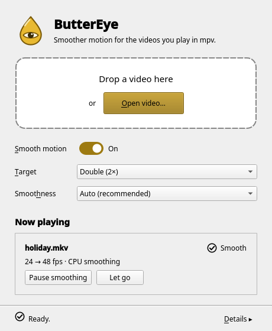
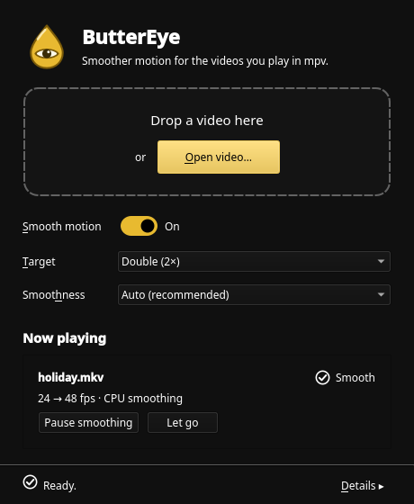
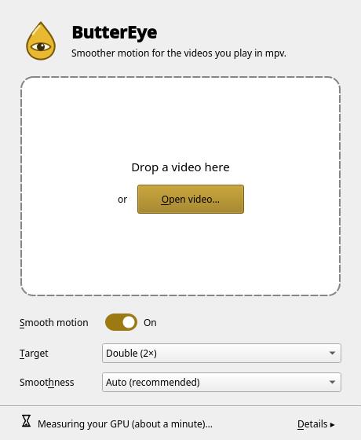
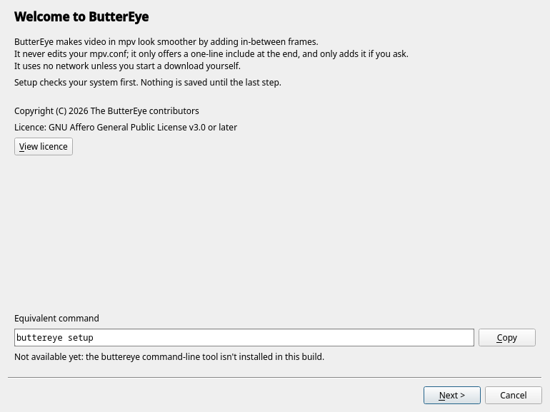
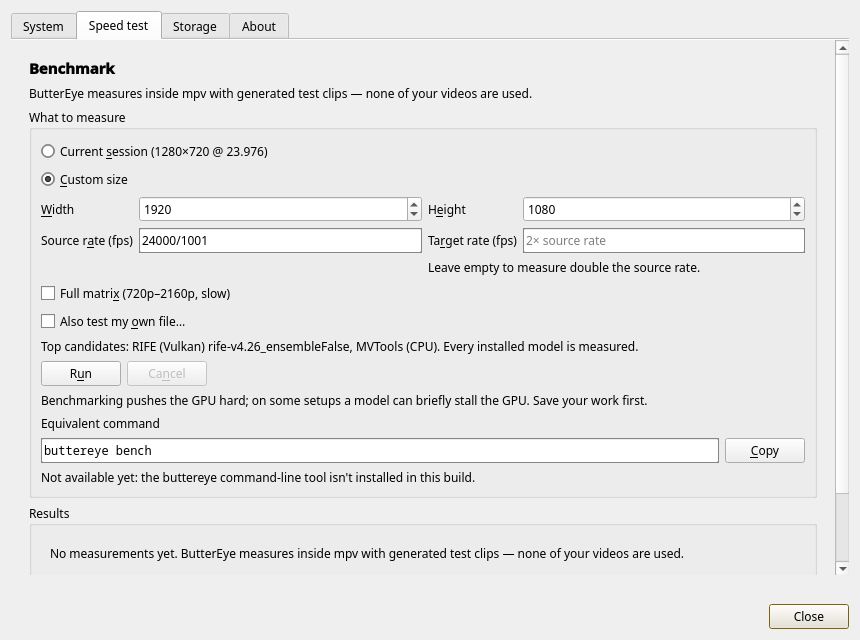
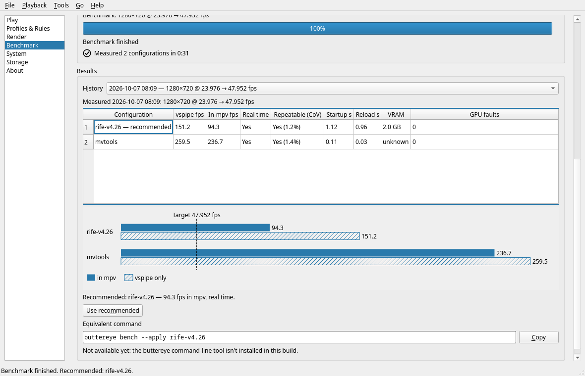
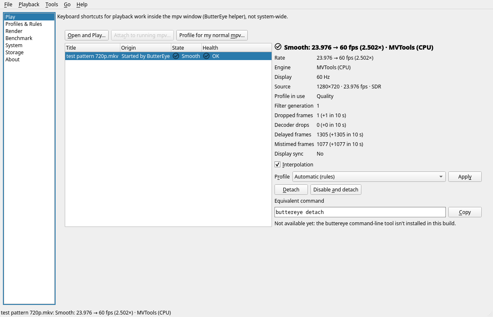
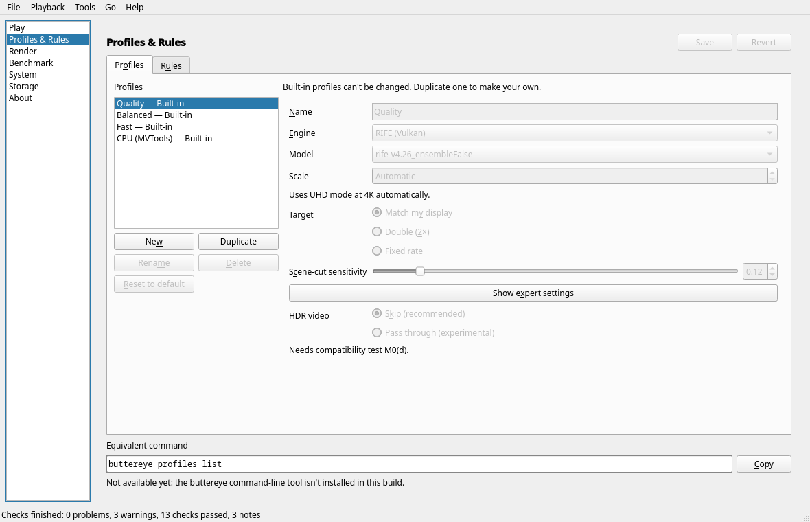
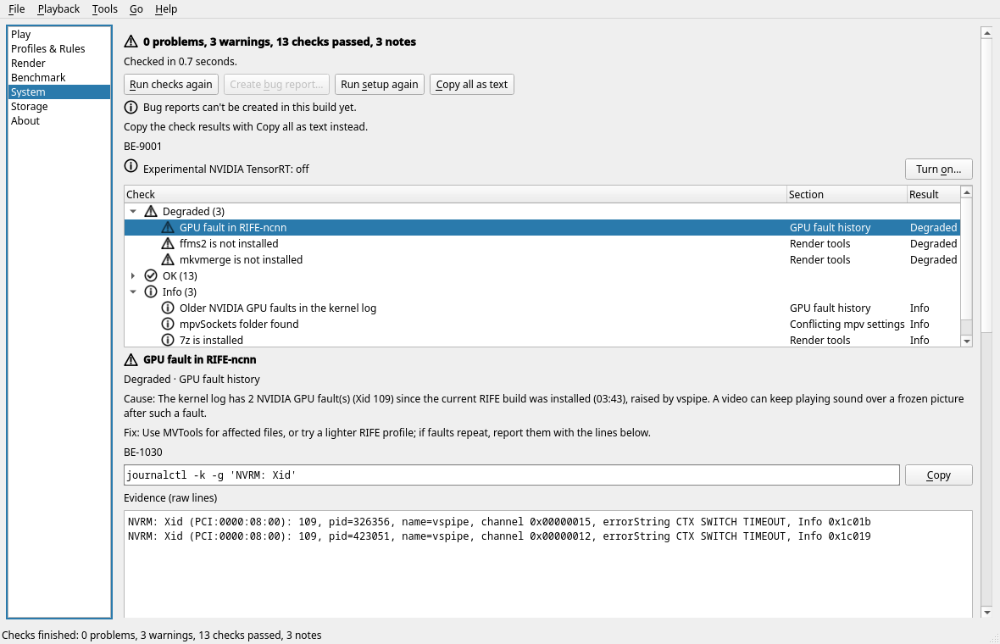

<!-- SPDX-License-Identifier: AGPL-3.0-or-later -->
<p align="center">
  
</p>

# ButterEye

ButterEye is a free, open-source (AGPL-3.0-or-later) smooth-motion control center for
[mpv](https://mpv.io) on Linux: it interpolates video to a rate that suits your display with
RIFE (Vulkan, via VapourSynth) or MVTools, live in mpv or as an offline render. It works
with your distribution's own mpv and never edits your `mpv.conf`. Status: pre-alpha; the
design lives in `docs/SCOPE.md` and `docs/design/GUI.md`.

Copyright (C) 2026 The ButterEye contributors. This program comes with ABSOLUTELY NO
WARRANTY; see the GNU Affero General Public License v3.0 or later, full text in
[`COPYING`](COPYING). Files ButterEye generates from its templates (`.vpy` scripts,
`buttereye.conf`, `input.conf` snippets, render job manifests) carry an additional
permission under AGPL section 7, in
[`LICENSES/AdditionRef-ButterEye-generated-output.txt`](LICENSES/AdditionRef-ButterEye-generated-output.txt)
(SCOPE §8.4; the wording is due a final check before the first public release). Both
files are shown in About, ship in the sdist and wheel (`license-files`), and must ship
as `%license` in the RPM.

## Status

Pre-alpha, verified on the dev box (Fedora 44, RTX 4090, mpv 0.41.0, VapourSynth R72) on
2026-10-07. "Works" means it ran against the real tools, not a fake.

**Works for real**

- **Live play** (`ButterEye.play`, GUI Play page): starts mpv with ButterEye's own include
  and profile, inserts the `@buttereye` VapourSynth filter and monitors it. MVTools and
  RIFE-ncnn (Vulkan) both reach ACTIVE; toggling interpolation, applying a profile, detaching
  (mpv keeps playing) and discovering leftover filters all work.
  Broken, slow and frozen filters are detected and rolled back. A 1280×720 24 fps clip
  played at 48 fps with MVTools (2×) and at 60 fps with RIFE v4.25-lite (2.5×) with no
  new Xid faults.
- **Doctor and setup** (System page, setup wizard): real checks of mpv, the in-mpv probe,
  packages, Vulkan, kernel Xid faults, conflicting `mpv.conf` settings and render tools,
  in under a second. Setup proposes an engine, runs a real smoke test and only then saves.
- **Profiles and rules** (Profiles & Rules page): `config.toml` load/validate/save with
  conflict detection and atomic writes; the rule tester explains which rule matched.
- **Benchmark** (Benchmark page): measures every installed RIFE model plus MVTools in
  vspipe and inside mpv, counts GPU faults, and can apply the recommendation.
- **Storage and About**: real folder sizes, packaged models, licence texts.
- **Lua helper in mpv**: Alt+b toggles the filter, Alt+B shows the status line.

- **NVIDIA TensorRT (experimental, opt-in)**: turn it on in **Details ▸ System ▸ Turn
  on…** (or `[general] trt_experimental = true` in `config.toml`). With a local `vstrt`
  build, live play, the speed test and smooth copies use RIFE through TensorRT; the
  GPU choices read "… · TensorRT", and the speed test runs once by itself so
  Automatic can choose it. A
  missing engine is built in the background on first use (about 30 s at 1080p);
  meanwhile the video plays with RIFE (Vulkan) and switches over when it's ready.
  On the RTX 4090: 1080p 2× at 262 fps and 23.976 → 60 at 101 fps in mpv, about
  4× the Vulkan path (`docs/spikes/m0l.md`). Setup, after adding NVIDIA's
  repositories as in `docs/spikes/m0k.md`:
  `contrib/build-vstrt.sh --with-python-deps --with-models`. The System checks list
  anything still missing, with the command that installs it.

**Not in this build yet** (the GUI shows an "isn't in this build yet" panel, BE-9001)

- Offline render (Render page) — no render provider yet; ffms2 is also not installed on
  the dev box (BE-4001).
- Attaching to an mpv you started yourself, and acting on leftover-filter notices from
  the Play page (ATTACH / ORPHANS).
- Writing the include line into your `mpv.conf` for you (the line is shown to copy).
- Bug-report bundles, model downloads and installing a model from a file.
- HDR pass-through (experimental; needs the M0(d) compatibility test).
- The `buttereye` command-line tool: the GUI shows the equivalent commands, but there is
  no CLI entry point yet.

**Known gaps**

- The spike RPMs ship incomplete third-party licence texts (BE-1021 in About).
- **RIFE at 1080p inside mpv, `concurrent-frames`.** RIFE-ncnn now uses mpv
  `concurrent-frames=8` with the plugin's `gpu_thread` kept at 4 (SCOPE §4.4, decided
  2026-10-07). With the bundled build (9.33-0.2.spike), v4.26 at 1080p 2× of 23.976 fps
  measured ~56–58 fps in mpv (`--untimed`, startup included) against ~45–47 fps with 4,
  and no GPU faults in 9 runs. Latency and seek behaviour with 8 are not measured yet
  (M0(b)); a profile can still set `concurrent_frames` explicitly.

## Screenshots

Taken over the real core on the dev box. The top row and the speed test show the default
window and its Details dialog; the setup wizard and the rest come from the classic
multi-page window (`BUTTEREYE_DEV=1 … --classic`, see below). More are in
[`docs/design/screenshots/`](docs/design/screenshots/).

<table>
  <tr>
    <td align="center" valign="top"><br><sub>The default window, playing a video smoothly</sub></td>
    <td align="center" valign="top"><br><sub>The same window with a dark palette</sub></td>
    <td align="center" valign="top"><br><sub>First start: the GPU is measured in the background</sub></td>
  </tr>
  <tr>
    <td align="center" valign="top"><br><sub>Setup wizard (classic window): checks first, nothing saved until the end</sub></td>
    <td align="center" valign="top"><br><sub>Details: the in-mpv speed test</sub></td>
  </tr>
  <tr>
    <td align="center" valign="top"><br><sub>Benchmark results (classic window): RIFE v4.26 vs MVTools, in mpv and in vspipe</sub></td>
    <td align="center" valign="top"><br><sub>Live session details (classic window): rates, engine, frame drops</sub></td>
  </tr>
  <tr>
    <td align="center" valign="top"><br><sub>Profiles &amp; Rules (classic window): built-in Quality, Balanced, Fast and CPU profiles</sub></td>
    <td align="center" valign="top"><br><sub>System checks (classic window): causes, fixes and raw evidence for each finding</sub></td>
  </tr>
</table>

## Development setup (Fedora 44)

The GUI uses the distro PySide6 (`python3-pyside6`, Essentials modules only), so the
virtualenv sees system site-packages:

```sh
python3 -m venv --system-site-packages .venv
.venv/bin/pip install pytest pytest-qt pytest-asyncio ruff mypy
```

Runtime tools the core talks to: `mpv` (≥ 0.41 with the VapourSynth filter), `vspipe`
(VapourSynth), `ffmpeg`, and the ButterEye COPR plugin packages
(`buttereye-vs-rife-ncnn`, `buttereye-vs-mvtools`, `buttereye-rife-ncnn-models`).

## Run the GUI

```sh
.venv/bin/python -m buttereye.gui
```

(The `buttereye-gui` entry point does the same once the package is installed.)

ButterEye opens one small window with two drop zones. Drop a video on the left one
(or press **Open video…**, Ctrl+O) and it plays in mpv with smooth motion; drop one on
the right (or press **Convert a video…**, Ctrl+Shift+O) to save a smooth copy as a new
file. There are three choices:

- **Smooth motion** — on or off. Off: new videos play normally, and videos already
  playing turn smoothing off.
- **Target** — *Double (2×)*, *60 fps*, or *Match your display (N Hz)* (the lowest
  refresh/k that at least doubles the video: 60 fps on 180 Hz, 48 on 144 Hz).
- **Smoothness** — *Auto (recommended)*, *Best quality — GPU*, *Lighter — GPU* or
  *CPU only*. Auto uses the GPU when the speed test shows it can keep up, and the CPU
  otherwise. The GPU choices are hidden when RIFE can't run on this computer.

To keep CPU and GPU load down, live CPU smoothing (MVTools) searches at full-pixel
precision (`pel=1`) from 720p up, and converted files use the lighter software encoder
presets `libx265` *fast* and `libsvtav1` *8* (about 1.5-2× less CPU than *medium*/*6*,
for files a few % larger at the same quality setting); conversions keep MVTools at
`pel=2`. See SCOPE §7.5.

Each playing video gets a row with its rates (for example "24 → 48 fps"), whether the
GPU or the CPU is smoothing it, a **Pause smoothing** button and **Let go** (mpv keeps
playing; ButterEye stops managing it).

The first start sets ButterEye up silently (checks, a short test run, settings) and
then measures your GPU in the background for about a minute; you can play videos while
it runs. ButterEye never edits your `mpv.conf`. **Details ▸** has the system checks
(with error codes and fix commands), the speed test, storage and licences.

Your choices are stored in `~/.config/buttereye/config.toml` as one profile, `simple`,
with a single rule that uses it. The earlier multi-page window (profiles, rules,
render) is still available for development: `BUTTEREYE_DEV=1 .venv/bin/python -m
buttereye.gui --classic`.

## Tests and checks

```sh
QT_QPA_PLATFORM=offscreen QT_ACCESSIBILITY=1 .venv/bin/pytest
.venv/bin/ruff check .
.venv/bin/mypy buttereye/core buttereye/gui   # strict, see pyproject.toml
```

The suite runs under memory failsafes (`tools/memguard.py`). It refuses to start when less
than 4 GiB is available, and runs inside a systemd user scope capped at 8 GiB, so only the
tests are killed if they go over. A watchdog also stops the run and every mpv/vspipe it
started when the system falls below 3 GiB available. To change these, set
`BUTTEREYE_MEM_MAX_MIB`, `BUTTEREYE_MEM_START_MIB` or `BUTTEREYE_MEM_FLOOR_MIB`;
`BUTTEREYE_NO_MEMCAP=1` drops the cap but keeps the other two. `tools/perf/breakdown.py`
uses the same failsafes.

Markers: `integration` (needs `mpv` and `vspipe`), `gpu` (needs a real GPU), `devbox`
(needs the installed `buttereye-*` RPMs) are skipped automatically when their
requirements are missing; `manual` runs only with `--run-manual`. Tests never touch your
real `~/.config`: the `xdg_env` fixture points `HOME` and every XDG directory at
temporary directories.

## Layout

- `buttereye/core/` — GUI-free asyncio core; `api.py` is the facade the GUI and CLI use.
- `buttereye/core/testing/` — `FakeCore` and named scenarios, for tests only.
- `buttereye/gui/` — PySide6 front-end (thin layer over the core, thread bridge).
- `docs/` — scope, design, error codes (`docs/errors.md`), spike records.
